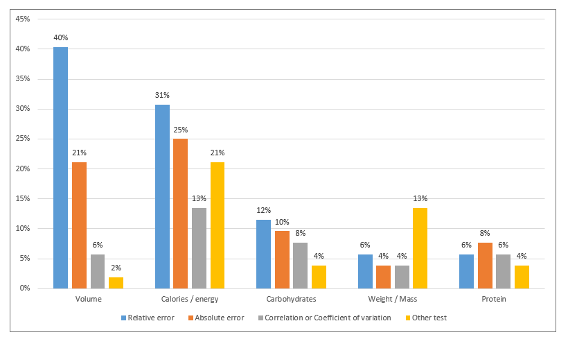

## Paper Title
> AI-Based Digital Image Dietary Assessment Methods Compared
to Humans and Ground Truth: A Systematic Review

**Authors:**  Eleanor Shonkoff, Kelly Copeland Cara, Xuechen Pei, Mei Chung, Shreyas Kamath, Karen Panetta, and Erin
Hennessy 
**Year:**  2023
**Venue / Journal:**  Annals of Medicine
**File:**  https://scholarworks.merrimack.edu/cgi/viewcontent.cgi?article=1195&context=health_facpubs

---

## 1. Problem Statement
> What problem does this paper address? Why does it matter?

This paper is a systematic review comparing fully automated AI-based methods of dietary assessment from Digital Images (DI) to human assessors and to existing ground truths. It essentially looks at how similar AI techniques are to human assessors or ground truths when analyzing DI of food for diet-related features.
This matters because AI could make food tracking easier for researchers and ultimately reduce errors/bias from human assessors.

---

## 2. Dataset(s) Used
> What data did the authors use? How large? How was it collected/labeled?

Since this is a review of literature that's available, the authors did not use one specific dataset. They searched 4 electronic databases (Web of Science, Embase, MEDLINE, CENTRAL) and also checked references for additional studies.
As shown in Figure 1, they identified 14,124 unique publications, screened the titles and abstracts, and then reviewed the full texts based on their inclusion criteria. After the selection process, 52 studies published between 2010 and 2023 were included in the final review.

---

## 3. Methods
> What AI/ML approach was applied? Describe the model architecture or algorithm.

Since this is a review paper, the authors did not build one specific AI model. Instead, they compared the methods used across the 52 studies.

For food detection and classification, 79% of the studies used CNN-based models. These included models such as Mask R-CNN, ResNet50, VGG-16, multi-task CNNs, and other neural networks.

For portion and volume estimation, 12 studies (34%) used 3-D volume or model reconstruction. Other methods included stereo images/stereo matching, RANSAC, SURF, surrounding boxes, structured light systems, and even virtual reality-based size estimation.

Overall, most systems followed a similar process:

Food image → detect/classify food → estimate portion or volume → estimate calories/nutrients
---

## 4. Key Results
> What were the main findings? Include specific metrics (accuracy, AUROC, RMSE, IoU, etc.).

| Metric | Value |
|---|---|
| Calorie estimation error | 0.10% – 38.3% |
| Volume estimation error | 0.09% – 33% |

Overall, AI estimates were generally close to human estimates. The paper also found that simpler foods usually had lower errors than more complex meals.

As shown in the supplemental figure below, **relative error was the most commonly used metric**, especially for volume (**40%**) and calories/energy (**31%**).

*Supplemental Figure: Different evaluation metrics used across the reviewed studies.*

---

## 5. Limitations
> What are the weaknesses or open questions the authors identify?

One main limitation was that the 52 studies used different datasets, AI methods, ground truth measurements, and evaluation metrics, which made them hard to directly compare. The authors also mentioned that very few studies directly compared AI estimates to human estimates. Another limitation was the lack of a standard way to evaluate and report errors, making it difficult to determine which AI methods perform best. The paper also showed that more testing is still needed on complex and real-world meals, since simpler foods usually had lower errors.

---

## 6. Relevance to Our Project
> How does this paper connect to the AI dietary assessment pipeline we are building?

This paper is relevant to our project because we are also using AI to analyze food images and estimate food consumption. It also shows why having a good ground truth is important so we can compare our AI estimates to the actual food amount.

---

## 7. One Thing I Found Surprising or Didn't Understand
> Write one honest observation — this keeps the reviews useful and honest.

One thing I did not fully understand was how the authors could confidently compare the different error rates when the studies were using very different datasets and evaluation methods.
